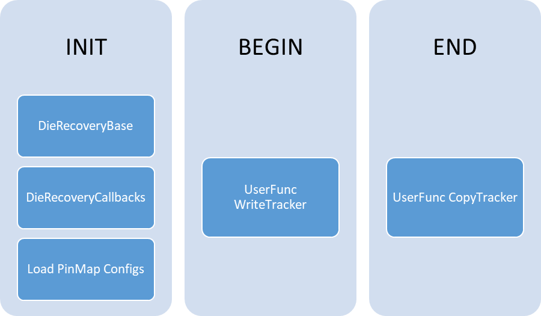

# DDG Die Recovery
### Rev 0

##

## Contents

1. [Configuration](#configuration)  
    1.1 [TestProgram Overview](#testprogram-overview)  
    1.2 [TestProgram Instance details](#testprogram-instance-details)  
2. [Basic Structures](#basic-structures)  
    2.1 [PinMap](#pinmap)  
    2.2 [Tracker](#tracker)  
    2.3 [Rules](#rules)  
3. [Usages](#usages)  
    3.1 [Vmin Template](#vmin-template)  
    3.2 [Callbacks (Evergreen or Prime Templates)](#callbacks-evergreen-or-prime-templates)  
    3.3 [Prime UserCode](#prime-usercode)  
4. [File Formats](#file-formats)  
    4.1 [Tracker File](#tracker-file)  
    4.2 [PinMap File](#pinmap-file)  
    4.3 [Recovery Rules File](#recover-rules-file)  
5. [Custom PinMap](#custom-pinmap)  
    5.1 [Location](#location)  
    5.2 [Requirements for Custom PinMapDecoder](#requirements-for-custom-pinmapdecoder)  
  
    
## Configuration  

### TestProgram Overview  




### TestProgram Instance details  

-   INIT Flow  
    -   DieRecoveryBase TestClass  
        -   Builds all the internal structures and configurations  
        -   Must be run once in INIT, before the PrimeInitTestMethod instance  
        -   Required Parameters  
            -   Mode = Configure  
                -   Sets the templates mode to load configuration files.
            -   TrackerFile = "./PrimeConfigs/DieRecoveryTrackers.json"  
                -   Defines the trackers and initial values.  
                -   See [TrackerFile format section](#tracker-file)  
            -   RulesFile = "./whatever/Recovery.xml"  
                -   Creates the Recovery rules which can be run on trackers.
                -   See [Recovery Rules File](#recovery-rules-file)
            -   AllowDownBins = True/False (default=True)
                -   When False - Each tracker can only be written once, if it is every written to a different value (ie a DownBin) the operation will fail.
                -   Meant to be used in DownStream sockets where the DFF value for the Trackers is the only valid setting. 
    -   DieRecoveryCallbacks TestClass  
        -   Registers the prime callback functions so they are available
            to Evergreen or Prime test instances.  
        -   No required parameters.  
        -   See
            [PrimeWiki](https://dev.azure.com/mit-us/PRIME/_wiki/wikis/PRIME.wiki/406/Calling-Prime-C-Sharp-Code-from-EVG-UF?anchor=%5B2%5D-call-your-new-callback-from-an-evg-uf)
            for more information on Prime callbacks and how to call
            them.  
    -   Load PinMap Configs  
        -   Use LoadPinMap callback to load the pin map configuration
            files.  
        -   One iCUserFuncTest per PinMap type is required.  
        -   See [Callbacks (Evergreen or Prime
            Templates)](#callbacks-evergreen-or-prime-templates) and
            [PinMap File](#pinmap-file) for details  
        -   Example  
            ```
            Test iCUserFuncTest LoadIaCoreNoaDieRecoveryPinMaps  
            {  
                function_name = "CPD_DEBUG!ExecPrimeCsCallback";  
                function_parameter = "LoadPinMapFile(--decoder PinToSliceIndexDecoder --file ./PrimeConfigs/PinMaps_IACORE_NOA.json)";  
            }  
            ```

-   Begin (or Start?) Flow  
    -   WriteTracker Callback function  
        -   Initialize the tracker from a GSDS Token, DFF Token, HDMT
            User Variable or a literal value.  
        -   Can be anywhere in the flow, as long as the source token is
            defined.  
        -   Argument is a single string, fields are space separated. See
            [Callback](#callbacks-evergreen-or-prime-templates) section
            for more details.  
        -   List of fields (Tracker is required, only one of
            Value/GsdsToken/DffToken/UserVar should be supplied)  
            -   --tracker – comma separated list of tracker names.  
            -   --value – Literal value to write to the tracker.  
            -   --gsds – Name of GSDS token to get the value from.  
                -   Format = G.\[LU\].S.Name  
            -   --dff – Name of the DFF Token to get the value from.  
                -   Format = *DieID*.*OperationType*.*TokenName*  
            -   --uservar – Name of the HDMT User Variable to get the
                value from.  
                -   Format = Collection.Name  
        -   Example Literal  
            ```
            Test iCUserFuncTest InitTrackerLiteral  
            {  
                function_name = "CPD_DEBUG!ExecPrimeCsCallback";  
                function_parameter = "WriteTracker(--tracker MyTracker --value 0011)";  
            }  
            ```
        -   Example GSDS  
            ```
            Test iCUserFuncTest InitCoreTrackerFromGsds  
            {  
                function_name = "CPD_DEBUG!ExecPrimeCsCallback";  
                function_parameter = "WriteTracker(--tracker CORE0,CORE1,CORE2,CORE3,CORE4,CORE5,CORE6,CORE7 --gsds G.U.S.DFFCHECK_SLICE)";  
            }  
            ```
        -   Example DFF  
            ```
            Test iCUserFuncTest InitCoreTrackerFromDff  
            {  
                function_name = "CPD_DEBUG!ExecPrimeCsCallback";  
                function_parameter = "WriteTracker(--tracker TRACKERNAME --dff *dieid*.*optype*.*tokenname*)";  
            }  
            ```

-   End Flow  
    -   CopyTracker Callback function  
        -   Copies the Tracker value to a GSDS Token, DFF Token, or HDMT
            User Variable.  
        -   Can be anywhere in the flow.  
        -   Argument is a single string, fields are space separated. See
            [Callback](#callbacks-evergreen-or-prime-templates) section
            for more details.  
        -   List of fields (Tracker is required, at least one of
            GsdsToken/DffToken/UserVar is required (more are fine))  
            -   --tracker – comma separated list of tracker names.  
            -   --gsds – Name of GSDS token to write the value to.  
                -   Format = G.\[LU\].S.Name  
            -   --dff – Name of the DFF Token to write the value to.  
                -   Format = *TokenName* or *DieID*.*TokenName*  
            -   --uservar – Name of the HDMT User Variable to write the
                value to.  
                -   Format = Collection.Name  
        -   Example GSDS  
            ```
            Test iCUserFuncTest CopyCoreTrackerToGsds  
            {  
                function_name = "CPD_DEBUG!ExecPrimeCsCallback";  
                function_parameter =
            "G.U.S.Dummy=CopyTracker(--tracker CORE0,CORE1,CORE2,CORE3,CORE4,CORE5,CORE6,CORE7 --gsds G.U.S.DFFCHECK_SLICE)";  
            }  
            ```

        -   Example DFF  
            ```
            Test iCUserFuncTest CopyCoreTrackerToDff  
            {  
                function_name = "CPD_DEBUG!ExecPrimeCsCallback";  
                function_parameter = " CopyTracker(--tracker TRACKERNAME --dff ID1.SOMETOKEN)";  
            }  
            ```

## Basic Structures  

### 

### PinMap  

-   similar to pin_maps in DieRecovery.xml  
-   3 functions  
    -   Generate tracker/bitvector from plist failures
        (IFunctionalTestForSearch object).  
    -   Mask plist from tracker/bitvector.  
    -   Disable IP/Core/Slice from tracker/bitvector.  
        -   This is the one that's new, previously it was just an
            action/sequence containing a hardcoded fuse config.  
        -   Now it can be anything, but its tied to the pin map … so
            CoreDisable and SliceDisable will require different pinmaps  
            … this might change if it becomes too cumbersome to use.  
-   PinMap types are defined in C\# code (called PinMapDecoders), easy
    to add more.  
    -   See [Custom PinMap](#custom-pinmap) section for details.  
-   Current PinMapDecoders types:  
    -   PinToSliceIndexDecoder - Able to map pin(s) to index(es) in a
        bitvector/tracker. Used for things that get per-core results out
        on different pin. (eg mlc/slice sbft, NOA_MAP on TGL)  
    -   AnyFailSingleSliceDecoder - Maps any failure on a list of pins
        to a "current" index in a bitvector/tracker. Used for things
        that test one core at time (eg SCAN_CORE_CBO on TGL)  
-   <s>Current PinMaps Instances:</s>  
    -   <s>CORE_NOA_MAP, SLICE_NOA_MAP - equivalent to TGL NOA_MAP
        but one writes fusecfg to IA_CORE_DISABLE_MASK while the
        other does LLC_SLICE_IA_CORE_DIS.</s>  
    -   <s>SCAN_CORE_CBO, SCAN_SLICE_CBO - like TGL
        SCAN_CORE_CBO</s>  
    -   <s>Also have Per-Core versions (for Vmin template, more on that
        later…)</s>  
        -   <s>CORE0_NOA, CORE1_NOA, … , CORE7_NOA</s>  
        -   <s>SLICE0_NOA, SLICE1_NOA, … , SLICE7_NOA</s>  
        -   <s>CORE0_SCAN, CORE1_SCAN, …, CORE7_SCAN</s>  
        -   <s>SLICE0_SCAN, SLICE1_SCAN, …, SLICE7_SCAN</s>  
    -   PinMaps Instances are now loaded using the LoadPinMapFile
        callback. See [PinMap File](#pinmap-file) for details.  

### 

### Tracker  

-   Simple BitArray used to track status of anything. Name/size/meaning
    is all user defined.  
-   Current Tracker instances  
    -   SliceTracking (8 bits)  
    -   Per-Core trackers (for Vmin template, more on that later)  
        -   CORE0, CORE1, …, CORE7 (each 1 bit)  

### Rules  

-   Same as Evergreen "defeaturing_rules", but only current support
    "ValidCombinations" modes (more can be added as needed)  
-   Same fields/structure Evergreen ValidCombinations
    mode/name/size/type with list of valid bitvectors.  
-   Usage/interface still being worked out with Vmin template…  

## Usages  

### 

### Vmin Template  
*see the VminTC document for the latest, these parameters might be out-of-date and are only for examples.*
-   Example  
    ```
    Test VminTC TRANS_CORE_VMIN_K_CHKCRF3_0808XX_VCORE_F3_2200_PRIME_1504  
    {  
        TestMode = "MultiVmin";  
        CornerIdentifiers = "CR0@F3,CR1@F3,CR2@F3,CR3@F3";  
        FlowNumber = "4";  
      
        VoltageTargets = "CORE0,CORE1,CORE2,CORE3";  
        StartVoltages = "0.55,0.55,0.55,0.55";  
        EndVoltageLimits = "1.35V,1.35V,1.35V,1.35V";  
        StepSize = "0.01";  
      
        ForwardingMode = "Merge";  
        FeatureSwitchSettings = "fivr_mode_on,disable_cores";  
        VoltageOverrides = "GT:0.6";  
        FivrCondition = "NOM";  
      
        LevelsTc = "SCN_CORE_PRIME::IO_DDR_univ_lvl_nom_lvl_SHARED_511E5BCD2BB65B457E04277F92FBBF5C77C6395E0D1AA5DDC416894A5DF4D1E4";  
        TimingsTc = "SCN_CORE_PRIME::cpu_func_sdr_univ_sta_univ_univ_b100_t100_d100_SHARED_0F9EB791BB9B601C383F5D7133A2C4CB6763527F7EB0E7EE842D9A424872470D";  
        Patlist = "scn_core_x_vccc_f3_chkcrf3_mEn100_tk6_core_trans_classhvm_list";  
      
        ScoreboardBaseNumber = 3059;  
        PatternNameMap = "1,2,3,4,5,6,7";  
        ScoreboardMaxFails = 20;  
        ScoreboardEdgeTicks = 3;  
        LogLevel = "PRIME_DEBUG";  
    
        ### DIE_RECOVERY OPTIONS ###_  
        RecoveryTracking = "CORE0,CORE1,CORE2,CORE3";  
        PinMap = "CORE0_NOA,CORE1_NOA,CORE2_NOA,CORE3_NOA";  
        InitialMaskBits = "0000";  
        RecoveryOptions = "CoreDefeaturingVector,2";  
    }  
    ```

-   RecoveryTracking - Comma separated Names of the DieRecovery Trackers.
    Needs to match the "Name" field of one of the trackers from the TrackerFile.
-   PinMap - Comma separated names of the PinMaps.
    Needs to match with the "Name" fied from one of the pinmap decoder files
-   InitialMaskBits - Raw bitmask Combined (OR'd) with the tracker value to set the initial
    mask for testing.  
-   RecoveryOptions - This is the DieRecovery Rules to run after the search.
    - Should be 2 comma separated values, the first is the Rule Name to run, and the 2nd is the minimum size allowed for a "Pass" result.
    - For speedflows in TPIE use -- RecoveryOptions = "CoreDefeaturingVector,\{CORE_SELECT}";

### 

### Callbacks (Evergreen or Prime Templates)  

See the separate DieRecoveryCallbacks document for details on what functions are available.

### 

### Prime UserCode  

-   All the underlying code is available to any Prime UserCode by
    including the DDG.DieRecoveryBase.Release NuGet.  
-   Main Interfaces  
    -   using DDG;  
    -   DieRecovery  
        -   IDieRecovery x =
            DDG.DieRecovery.Service.Get(*&lt;comma_separated_list_of_trackers&gt;*)  
        -   BitArray tracker = x.GetMaskBits()  
        -   x.UpdateTrackingStructure(BitArray newValue)  
        -   List&lt;DefeatureRule.Rule&gt; passingRules =
            x.RunRule(string ruleName)  
    -   PinMap  
        -   IPinMap y =
            DDG.PinMap.Service.Get(*&lt;comma_separated_list_of_PinMaps&gt;*)  
        -   BitArray tracker = y.DecodeFailure(IFunctionalTestForSearch
            plist, int? currentSlice = null)  
        -   y.MaskPins(BitArray mask, ref IFunctionalTestForSearch
            plist)  
        -   y.ApplyPatConfig(BitArray tracker, string plist)  

## File Formats  

### Tracker File  

-   Json input file to define the DieRecovery Trackers.  
    -   Fields  
        -   Trackers – List Type – Required -- top level field, contains the list of tracker objects.  
        -   Tracker Object  
            -   Name – String Type – Required – Name of the Tracker.  
            -   Size – Integer Type – Required – Size (number of elements) of the tracker.  
            -   InitialValue – String Type – Optional – defines the initial value of the tracker, MSB first.  
            -   LinkDisable - List of Strings - Optional - List of trackers that should be disabled if this tracker is disabled.  
-   Example  
    ```json
    {  
        "Trackers": [  
            { "Name": "SliceTracking", "Size": 8, "InitialValue": "00001111" },  
            { "Name": "CORE0", "Size": 1, "InitialValue": "0" },  
            { "Name": "CORE1", "Size": 1, "InitialValue": "0" },  
            { "Name": "CORE2", "Size": 1, "InitialValue": "0" },  
            { "Name": "CORE3", "Size": 1, "InitialValue": "0" },  
            { "Name": "CORE4", "Size": 1, "InitialValue": "1" },  
            { "Name": "CORE5", "Size": 1, "InitialValue": "1" },  
            { "Name": "CORE6", "Size": 1, "InitialValue": "1" },  
            { "Name": "CORE7", "Size": 1, "InitialValue": "1" }  
            { "Name": "SLICE0",  "Size": 1, "InitialValue": "0",   "LinkDisable": [ "ATOM_M0", "ATOM_M1", "SLICE1" ] },  
            { "Name": "SLICE1",  "Size": 1, "InitialValue": "0",   "LinkDisable": [ "ATOM_M0", "ATOM_M1", "SLICE0" ] },  
            { "Name": "ATOM_M0", "Size": 4, "InitialValue": "0000"    },  
            { "Name": "ATOM_M1", "Size": 4, "InitialValue": "0000"    }  
        ]  
    }  
    ```

### PinMap File  

-   PinMap Instances are now created through the LoadPinMapFile callback
    function.  
-   Only one Type of PinMap can be loaded with each instance of the
    callback.  
-   Pinmaps of the same type can be grouped in a single file or split
    into multiple files.  
-   There is no restriction on the number or ordering of the callback
    instances. Create as many as needed to load all the Pinmaps.  
-   PinMaps are stored and referenced using their “Name” field so that
    must be unique.  
-   Callback to load pin map files:  
    -   LoadPinMapFile(--decoder *PinMapType* --file *Filename.json*)  
        -   --decoder *PinMapType* - The C\# Class name of the PinMapDecoder.  
            -   Current PinMapTypes are PinToSliceIndexDecoder, 
                AnyFailSingleSliceDecoder, AtomDecoder and ConcurrentTracesDecoder.
        -   --file *Filename.json* – Name of the file containing a list of
            PinMapType objects.  
-   PinMap Fields  
    -   Common fields  
        -   <u>Name</u> – name of the pinmap. This is the name that will
            be used for the VMin Templates “PinMap” parameter. It must
            be unique.  
        -   <u>Size</u> – number of bits returned by this PinMap. This
            should match the tracker size associated with this pinmap
            (the RecoveryTracking parameter of the VMin template).  
        -   <u>PatternModify</u> – the FuseConfig or PatModify token
            used to disable the IP associated with this PinMap. Used
            when setting “disable_\*” in the VMin templates
            FeatureSwitchSettings parameter. Could be empty if it
            doesn’t apply to the IP being tested.  
        -   <u>SharedStorageResults</u> – SharedStorage token to store last
            decoded result as string.  
    -   Fields for PinMapType = PinToSliceIndexDecoder  
        -   <u>PinToSliceIndexMap</u> – Dictionary which maps pin names
            to bit locations within the associated tracker. Each pin can
            map to multiple bit locations and multiple pins can map to
            the same bit locations. (ie both PinA and PinB can set bit
            1, and PinC can set both bits 2 and 3)  
        -   <u>DoaPins</u> – List of pins to be ignored during pin mask.
    -   Fields for PinMapType = AnyFailSingleSliceDecoder  
        -   <u>PinList</u> (optional) – list of pins. All tracking bits
            are marked as failing if any pin in this list is failing. If
            empty, then any failing pin causes the tracker to be marked
            as failing. Used when doing per-core testing so any failure
            means that core is bad.  
            -   These must be pins, currently pingroups are not
                supported.  
-   Example PinMap Config files  
    -   PinMapType = PinToSliceIndexDecoder  
    ```json
    [  
        {  
            "Name":"CORE0_NOA", "PatternModify":"CORE_DISABLE0", "Size":1,  
            "PinToSliceIndexMap":{"IP_CPU::NOAB_00":[0],"NOAB_00":[0],"IP_CPU::NOAB_08":[0],"NOAB_08":[0]}  
        },  
        {  
            "Name":"CORE1_NOA", "PatternModify":"CORE_DISABLE1", "Size":1,  
            "PinToSliceIndexMap":{"IP_CPU::NOAB_01":[0],"NOAB_01":[0],"IP_CPU::NOAB_09":[0],"NOAB_09":[0]}  
        },  
        {  
            "Name":"SLICE0_NOA", "PatternModify":"SLICE_DISABLE0", "Size":1,  
            "PinToSliceIndexMap":{"IP_CPU::NOAB_00":[0],"NOAB_00":[0],"IP_CPU::NOAB_08":[0],"NOAB_08":[0]},
            "DoaPins": ["IP_CPU::TDO"]
        },  
        {  
            "Name":"SLICE1_NOA", "PatternModify":"SLICE_DISABLE1", "Size":1,  
            "PinToSliceIndexMap": {"IP_CPU::NOAB_01":[0], "NOAB_01":[0], "IP_CPU::NOAB_09":[0], "NOAB_09":[0]},  
            "DoaPins": ["IP_CPU::TDO"]
        },  
        {  
            "Name":"FAKE_EXAMPLE_MULTIBIT", "PatternModify": "NOT_A_REAL_PATCFG", "Size": 10,  
            "PinToSliceIndexMap": {"PIN_ODDCORES":[1,3,5,7,9], "PIN_EVENCORES":[0,2,4,6,8]}  
        }  
    ]  
    ```

    -   PinMapType = AnyFailSingleSliceDecoder  
    ```json
    [  
        {  
            "Name":"CORE0_SCAN", "PatternModify":"CORE_DISABLE0", "Size":1  
        },  
        {  
            "Name":"CORE1_SCAN", "PatternModify":"CORE_DISABLE1", "Size":1  
        },  
        {  
            "Name":"SLICE0_SCAN", "PatternModify":"SLICE_DISABLE0", "Size":1  
        },  
        {  
            "Name":"SLICE1_SCAN", "PatternModify":"SLICE_DISABLE1", "Size":1  
        },  
        {  
            "Name":"FAIL_ONLYIF_NOA_FAILS", "PatternModify":"SLICE_DISABLEALL", "Size":1,  
            “PinList”: [“NOA0”, “NOA1”, “NOA2”, “NOA3”, “NOA4”, “NOA5”, “NOA6”, “NOA7”]  
        }  
    ]  
    ```

    -   PinMapType = AtomDecoder  
    ```json
    [  
        {  
            "Name":"ATOMARRAY_MOD0", "PatternModify":"NONE", "Size":4,  
            "Module":0, "Content":"ARRAY", "Pin":"IP_CPU::NOA08"  
        },  
        {  
            "Name":"ATOMARRAY_MOD1", "PatternModify":"NONE", "Size":4,  
            "Module":1, "Content":"ARRAY", "Pin":"IP_CPU::NOA09"  
        },  
        {  
            "Name":"ATOMFUNC_MOD0", "PatternModify":"NONE", "Size":4,  
            "Module":0, "Content":"FUNC", "Pin":"IP_CPU::NOA08"  
        },  
        {  
            "Name":"ATOMFUNC_MOD1", "PatternModify":"NONE", "Size":4,  
            "Module":1, "Content":"FUNC", "Pin":"IP_CPU::NOA09"  
        } 
    ]  
    ```

  -   \* other pinmap decoders can be added by users so this list might not be complete \*  

### Recovery Rules File  

-   Currently using Evergreen file format for recovery rules so the file
    can be shared with YBS.  
-   Currently only "ValidCombinations" rule is supported  
-   Example  
```xml
 <?xml version= "1.0" encoding= "utf-8"?>  
 <recovery>  
   <defeaturing_rules>  
     <!-- Used for  Die Recovery to look for a matching combination for an specific SliceTracking  -->  
     <!-- Index size is 8-bits (7-0) as MSB>LSB, TGL42 is 4Core so top 4 bits are set to "1" = DISABLED  -->  
     <rules name = "CoreDefeaturingVector"    index= "0-7" >	  
       <rule mode = "ValidCombinations"  name = "4C" size = "4"  type= "FullyFeatured">  
         <bitvector  value = "00001111"/>  
       </rule>  
       <rule mode = "ValidCombinations"  name = "2C" size = "2"  type= "Recovery">  
         <bitvector  value = "00111111"/>  
         <bitvector  value = "11001111"/>  
       </rule>  
     </rules>  
   </defeaturing_rules>  
 </recovery>  
```

## Custom PinMap  

-   Custom PinMaps require a custom PinMapDecoder to be defined in C\#
    code within the DieRecovery project.  

### 

### Location  
-   Add custom PinMapDecoder to
    UserCode\\src\\Base\\DieRecovery\\DieRecovery\\PinMapDecoders\\  
-   Instantiate any custom PinMaps using the LoadPinMapFile callback  
    -   See [PinMap File](#pinmap-file) for details.  
-   Add Unit Tests to
    UserCode\\src\\Base\\DieRecovery\\DieRecovery.UnitTest\\  

### 

### Requirements for Custom PinMapDecoder  

#### 

#### Serializable  

1.  Instances will be serialized when saved by Prime SharedStorage.  
2.  Instances will be created by deserializing text from JSON config
    files.  
3.  Requirements  
    1.  Define a constructor that takes no arguments.  
    2.  Properties should all be public.  
        1.  Properties can be tagged with the “JsonProperty” attribute
            (from Newtonsoft.Json) if desired. This attribute defines an
            alternative name for this property in the json config file.
            Without this attribute the json name is the same as the
            properties name.  
    3.  Can use \[OnDeserialized\] to specify a method to be called
        after deserialization. This method can update
        non-serializable/private fields if needed. It can also be used
        when creating a new instance by deserializing to fill in
        properties that the user didn’t specify.  
4.  Notes  
    1.  BitArray objects are not serializable. Extension methods in the
        DDG namespace exist to convert BitArrays to/from strings.  
        1.  public static BitArray ToBitArray(this string data)  
        2.  public static string ToBinaryString(this BitArray data)  

#### 

#### Inherit from PinMapDecoderBase  

1.  Inherited Properties  
    1.  public string Name  
        1.  User-Defined name for the pin map.  
        2.  This is how the testprogram references this pinmap (value
            for the PinMap parameter of the Vmin Template)  
    2.  public string IpPatternConfigure  
        1.  User-Defined string containing information required to
            enable/disable the IP associated with the PinMap (if that is
            applicable to the pinmap).  
        2.  Base implementation treats this as a Prime Pattern Modify
            Configuration name, suitable for use with
            Prime.Services.PatConfigService.GetPatConfigHandle()  
    3.  public int NumberOfTrackerElements  
        1.  User-Defined size (number of elements that are being
            tracked) for this pinmap. Could be hard-coded or supplied
            when creating an instance depending on the pinmap needs.  

#### 

#### Implement IPinMapDecoder  

1.  BitArray GetFailTrackerFromPlistResults(IFunctionalTest test, int?
    currentSlice = null);  
    1.  Description  
        1.  Called from DDG SingleVmin and MultiVmin templates to decode
            the plist failures into a tracker value. “true” in the
            tracker means that slice/core/IP failed, “false” means that
            it passed.  
    2.  Parameters  
        1.  test – The Prime IFunctionalTest object that was executed.
            This can be casted to any of its child types to access fail
            or capture memory. For Example:  
            ```C#
                var captureFailureTest = test as ICaptureFailureTest;  
                if (captureFailureTest == null)  
                {  
                    throw new ArgumentException(…);  
                }  
            ```

        1.  currentSlice – For content types that execute one core/slice/ip at a
            time, this will be set to the current core/slice/ip. Most
            IPinMapDecoder classes can ignore this.  
        1.  Returns  
            1.  A BitArray representing the pass/fail status of each tracked IP.
                ‘true’ means fail, ‘false’ means pass.  
            2.  The size of the BitArray must match NumberOfTrackerElements.  
2.  List&lt;string&gt; MaskPlistFromTracker(BitArray mask, ref
    IFunctionalTest plist);  
    1.  Description  
        1.  Despite the name, this is meant to RETURN the names of pins
            to mask for the given mask parameter. If not applicable
            return an empty list.  
        2.  The IFunctionalTest parameter can be modified however any
            calls to SetPinMask() will be overridden before the plist is
            executed.  
    2.  Parameters  
        1.  mask – BitArray object representing which core/slice/IPs
            should be masked. A ‘true’ value means mask, a ‘false’ value
            means do not mask.  
            1.  The size of the BitArray will match
                NumberOfTrackerElements.  
        2.  plist – IFunctionalTest representing the search test.  
            1.  As of Prime4.00 this can be used to get the name of the
                plist/levels/timings associated with this test.  
    3.  Returns  
        1.  Names of pins in a list to mask. (List&lt;string&gt;) There
            is no restriction on the size of the returned list.  
3.  IPatConfigHandle GetPatConfigForSliceControl(BitArray iPConfigBits,
    string patlist);  
    1.  Description  
        1.  Build the pattern modify required to disable the
            core/slice/ip represented in the iPConfigBits tracker.  
    2.  Parameters  
        1.  iPConfigBits – BitArray object representing which
            core/slice/IPs should be disabled. A ‘true’ value means
            disable, a ‘false’ value means enable.  
            1.  The size of the BitArray will match
                NumberOfTrackerElements.  
        2.  patlist – name of the Pattern List to use when creating the
            IPatConfigHandle object.  
    3.  Returns  
        1.  The IPatConfigHandle which will mask the appropriate IPs in
            the supplied pattern list.  
        2.  <s>\*\*\* this may have to change to return a
            List&lt;IPatConfigHandle&gt; \*\*\*</s> With the addition of
            Multi-config support in Prime3.02 this will likely remain.  


          
