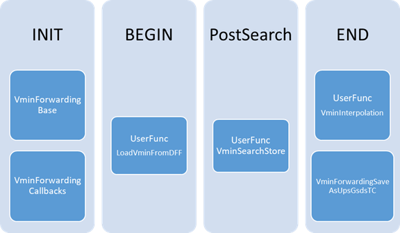

# DDG Vmin Forwarding
### Rev 0

##

## Contents

1. [Configuration](#configuration)  
    1.1 [TestProgram Overview](#testprogram-overview)  
    1.2 [TestProgram Instance details](#testprogram-instance-details)  
3. [Usages](#usages)  
    3.1 [Vmin Template](#vmin-template)  
    3.2 [Callbacks (Evergreen or Prime Templates)](#callbacks-evergreen-or-prime-templates)  
    3.3 [Prime UserCode](#prime-usercode)  
4. [File Formats](#file-formats)  

----   
## Configuration  

### TestProgram Overview  


----   
### TestProgram Instance details  

-   INIT Flow  
    -   VminForwardingBase TestClass  
        -   Builds all internal structures and configurations  
        -   Must be run once in INIT, before the PrimeInitTestMethod
            instance  
        -   Required Parameters  
            -   Mode = Configure  
            -   ~~ConfigFile = *vminconfig.json*~~  
                -   As of prime 5.02, the vmin forwarding configuration file is an ALEPH file, its no longer a parameter. Instead it should be included in the .env file under the ALEPH_FILES variable. The file name must contain "VminForwardingConfiguration".  
                -   Prime Vmin Forwarding configuration file which defines
                    all Voltage domains and corners.  
                -   See Prime Wiki for more details [Prime VminForwarding Service](https://dev.azure.com/mit-us/PRIME/_wiki/wikis/PRIME.wiki/9978/VminForwarding-Service)  
        -   Optional Parameters for DownsStream Location support (defaults in **bold**)  
            -   UseDffAsSource = True / **False**  
                -   Maps to Prime OperationModeFlag.UseLimitCheckAsSource  
                -   From Prime Wiki - _Usage of check/limit values as voltages sources at GetSourceVoltages method.  
                -   This will be set to True for Downstream Sockets where you want to use DFF'd VminData from PBIC (or any other location).  
            -   VminSinglePointMode = True / **False**  
                -   When True, forces VminTC to only run single point tests. Any Vmin Search will only execute the 1st voltage point and pass/fail based on that one execution.  
            -   SearchGuardbandEnable = True / **False**  
                -   When True, enables VminTC SearchGuardband parameter which defines a pass/fail limit separate from the EndSearchVoltage parameter. See VminTC for more details.  
            -   UseLimitCheck = True / **False**  
                -   Maps to Prime OperationModeFlag.UseLimitCheck  
                -   From Prime Wiki - _Usage of limit/check values to check if the input voltage is greater than the limit voltage at StoreVoltages method. If the comparison is true, the store operation for all the corners of the handler is not executed._  
            -   UseVoltagesSources = **True** / False  
                -   Maps to Prime OperationModeFlag.UseVoltagesSources  
                -   From Prime Wiki - _Usage of the corner's voltage values as sources at GetSourceVoltages method._  
                -   This should be False if UseDffAsSource is True.  
            -   StoreVoltages = **True** / False  
                -   Maps to Prime OperationModeFlag.StoreVoltages  
                -   From Prime Wiki - _If the input voltages should be stored at StoreVoltages method._  
                -   Probably should be False for downstream locations where you don't want to update the forwarded voltages.  
            -   DffMappingFile = __File__ (required if UseDffAsSource is True)
                -   File containing the VminCorner to DFF mapping information. See [DffMappingFile](#dffmapping)   
            -   DffMappingSet = __string__ (required if UseDffAsSource is True)
                -   Mapping set to use for VminCorner to DFF mapping. See [DffMappingFile](#dffmapping)  
            -   DffMappingOptype = __string__ (rquired if UseDffAsSource is True)
                -   DFF location (OpType) to use when loading dff data.   
    -   ~~VminForwardingCallbacks~~ CallbacksManager TestClass  
        -   Registers the prime callback functions so they are available
            to Evergreen or Prime test instances.  
        -  The VminForwardingCallbacks template was replaced with the CallbacksManager template which will register all callbacks. It will part of the the base testprogram by default.    
        -   No required parameters.  
        -   See
            [PrimeWiki](https://dev.azure.com/mit-us/PRIME/_wiki/wikis/PRIME.wiki/406/Calling-Prime-C-Sharp-Code-from-EVG-UF?anchor=%5B2%5D-call-your-new-callback-from-an-evg-uf)
            for more information on Prime callbacks and how to call
            them.  
  
- Begin Flow (or Start? just needs to be after DFF is initialized)  
    -   LoadVminFromDFF Callback function (OPTIONAL)  
        -   Writes SharedStorage with DFF data using the tokens configured in the VminForwardingBase instance. If UseDffAsSource was False this will do nothing.  
        -   Example  
            ```
            Test iCUserFuncTest ReadVminDFF  
            {  
                function_name = "CPD_DEBUG!ExecPrimeCsCallback";  
                function_parameter = "LoadVminFromDFF()";  
            }  
            ```

-   Post-Search Flow  
    -   VminSearchStore Callback function (OPTIONAL)  
        -   This is equivalent to the Evergreen function
            OASIS_GEN_FAST_tt!STCSearchStore  
        -   Creates a copy of the current VminForwarding Data tables
            which can be used for interpolation later.  
        -   Optional argument "--domains *domainlist*"  
            -   where *domainlist* is a comma separate list of domain names to save.  
            -   by default all domains are saved   
        -   Example – All Domains  
            ```
            Test iCUserFuncTest SaveAllSearchResults  
            {  
                function_name = "CPD_DEBUG!ExecPrimeCsCallback";  
                function_parameter = "VminSearchStore()";  
            }  
            ```
        -   Example – Only IA Core data is saved  
            ```
            Test iCUserFuncTest SaveCoreSearchResults  
            {  
                function_name = "CPD_DEBUG!ExecPrimeCsCallback";  
                function_parameter = "VminSearchStore(--domains CR,CRF,CRX2,CRX3)";  
            }  
            ```

-   END Flow  
    -   VminInterpolation Callback function (OPTIONAL)  
        -   This is equivalent to the Evergreen function
            OASIS_GEN_FAST_tt!STCInterpolationWithItuff  
        -   Usage
            -   VminInterpolation(--domains *ListOfDomains* --check_corners *ListOfCorners* --flow *GSDSFlowToken*)   
            -   *ListOfDomains* = A comma separated list of Domain names to run interpolation on. This should be the main domain names, not the instance names (ie CR, CRF ... not CR0, CR1...)   
            -   *ListOfCorners* = A comma separate list of Corner names with Check data to run interpolation on the other corners. (ie this is the list of corners that did NOT have -stc_interpolation=true in the FastInfra.xml file).   
            -   *GSDSFlowToken* = GSDS token (of the form G.U.I.tokenname) containing the current/passing flow number.  
        -   Example   
            ```
            Test iCUserFuncTest StcIaCoreData  
            {  
                function_name = "CPD_DEBUG!ExecPrimeCsCallback";  
                function_parameter = "VminInterpolation(--domains CR,CRF,CRX2,CRX3 --check_corners F1,F3,F6 --flow G.U.I.PassingFlow)";  
            }  
            ```

    -   VminForwardingSaveAsUpsGsdsTC TestClass 
        -   See also the full VminForwardingSaveAsUpsGsdsTC Template documentation.  
        -   Converts the current VMin forwarding tables into GSDS tokens for
            UPS.  
        -   This was previously done every time FAST was executed, now it
            needs to be done manually.  
        -   Default GSDS tokens match Evergreen token names.  
        -   GSDS Format matches Evergreen format.  
        -   Required/Default Parameters  
            -   MergeWithEvgData = False/True  
                -   Default is False  
                -   If True it will read the EVG Vmin data from
                    G.U.S.FAST_STC_V and merge those results with the
                    Prime Vmin data before exporting the new GSDS tokens.  
                    -   It must be run after
                        “OASIS_GEN_FAST_tt!STCInterpolationWithItuff” or
                        the results will be invalid.  
                -   This is meant as a temporary work-around while the
                    testprogram still includes iCFast test instances. It
                    should not be used in production.  
            -   UpsVfGsds = G.U.S.FAST_UPSVF  
                -   domain:freq\^vmin%freq\^vmin%freq\^vmin_domain:freq\^vmin%freq\^vmin%freq\^vmin  
                -   for domains with multiple instances "vmin" will have all vmins with 'v' as a separator (ie 1.0v1.1v1.2v1.3)  
                -   for the 1<sup>st</sup> flow with data.  
            -   UpsVfPassingFlowGsds = G.U.S.FAST_UPSVFPASSFLOW  
                -   domain:freq\^vmin%freq\^vmin%freq\^vmin_domain:freq\^vmin%freq\^vmin%freq\^vmin  
                -   for domains with multiple instances "vmin" will have all vmins with 'v' as a separator (ie 1.0v1.1v1.2v1.3)  
                -   for the passing flow.  
            -   FastStcGsds = G.U.S.FAST_STC_V
                -  domainX=cornerName:vmin|vmin|...|vmin_domainX=cornerName:vmin|vmin|...|vmin,...,domainZ=cornerName:vmin|vmin|...|vmin_domainZ=cornerName:vmin|vmin|...|vmin  
                -  for domains with multiple instances "vmin" will have all vmins with 'v' as a separator (ie 1.0v1.1v1.2v1.3)  
                -  Full vminforwarding data.  
            -   FastCornersGsds = G.U.S.FAST_CORNERS  
                -   domainX=cornerId1:vmin|vmin|...|vmin_domainX=cornerIdY:vmin|vmin|...|vmin,...,domainZ=cornerId1:vmin|vmin|...|vmin_domainZ=cornerIdY:vmin|vmin|...|vmin  
                -   for domains with multiple instances "vmin" will have all vmins with 'v' as a separator (ie 1.0v1.1v1.2v1.3)  
                -   Prime does not support the "cornerId" value ... these will all be 999 ... use FastStcGsds if possible.  
                -   Full vminforwarding data.  
            -   PassingFlowInputGsds = G.U.I.DDGVminForwardPassingFlow  
                -   *This will have to change once per-IP flow BFMC is supported**  
                -   GSDS token containing the passing/current flow.
                    Eventually Prime will auto-populate this (name will
                    likely change), but you can use a screen test
                    (GETCURRENTFLOW command) to put the value in any GSDS
                    token.  

## 

----   
## Basic Structures  

### 

See the TestPrograms VminForwarding.json file to find which Domains/Instances/Corners are defined.  
(insert link to base json for tgl here)  

----   
## Usages  

### 
 
----   
### Vmin Template  
*see the VminTC document for the latest, these parameters might be out-of-date and are only for examples.*  

-   Example  
    ```
    Test VminTC TRANS_CORE_VMIN_K_CHKCRF3_0808XX_VCORE_F3_2200_PRIME_1504  
    {  
        TestMode = "MultiVmin";  
        CornerIdentifiers = "CR0@F3,CR1@F3,CR2@F3,CR3@F3";  
        FlowNumber = "4";  
      
        VoltageTargets = "CORE0,CORE1,CORE2,CORE3";  
        StartVoltages = "0.55,0.55,0.55,0.55";  
        EndVoltageLimits = "1.35V,1.35V,1.35V,1.35V";  
        StepSize = "0.01";  
      
        ForwardingMode = "Merge";  
        FeatureSwitchSettings = "fivr_mode_on,disable_cores";  
        VoltageOverrides = "GT:0.6";  
        FivrCondition = "NOM";  
      
        LevelsTc = "SCN_CORE_PRIME::IO_DDR_univ_lvl_nom_lvl_SHARED_511E5BCD2BB65B457E04277F92FBBF5C77C6395E0D1AA5DDC416894A5DF4D1E4";  
        TimingsTc = "SCN_CORE_PRIME::cpu_func_sdr_univ_sta_univ_univ_b100_t100_d100_SHARED_0F9EB791BB9B601C383F5D7133A2C4CB6763527F7EB0E7EE842D9A424872470D";  
        Patlist = "scn_core_x_vccc_f3_chkcrf3_mEn100_tk6_core_trans_classhvm_list";  
      
        ScoreboardBaseNumber = 3059;  
        PatternNameMap = "1,2,3,4,5,6,7";  
        ScoreboardMaxFails = 20;  
        ScoreboardEdgeTicks = 3;  
        LogLevel = "PRIME_DEBUG";  
      
        RecoveryTracking = "CORE0,CORE1,CORE2,CORE3";  
        PinMap = "CORE0_NOA,CORE1_NOA,CORE2_NOA,CORE3_NOA";  
        InitialMaskBits = "0000";  
        RecoveryOptions = "CoreDefeaturingVector,2";  
    }  
    ```

    -   VoltageTargets defines the voltage domains/pins that are being
        searched. This is inherited from the Prime Vmin base class and
        doesn't allow sub-domains … so each domain/pin needs to be listed
        out. This is why all the other parameters are per-voltage domain.   
    -   CornerIdentifier is the list of Corners. Similar to evg, but
        per-core.   
        -   Nothing prevents you from specifying different F corners. This
            is for concurrentplist testing so you can test cores at F1 and
            GT at F3 or whatever, but you can do "CORE0@F1,CORE1@F1,CORE2@F6,CORE3@F6".   
        -   The Domain/Corner separator is an @ symbol -- CR1@F1, CLR@F6   
    -   FlowNumber is the Flow ID, same as evg. Supports a comma separated list of flow numbers (one for each CornerIdentifier), pending BFMC updates to support flow numbers per IP.   

### 
----

### Callbacks (Evergreen or Prime Templates)  

-   See the VminForwardingCallbacks documentation for specifics on the available functions and their usage/syntax.  

-   See the VoltageConverterCallbacks documentation for specifics on using VminForwarded data in non-vmin-search templates.  

-   See the PatternModification documentation for specifics on using VminForwarded data or Corner/Flow specific frequency data for pattern modifications.  

### 
----

### Prime UserCode

-   All the underlying code is available to any Prime UserCode by
    including the DDG.VminForwardingBase.Release NuGet.  
-   Main Interfaces  
    -   IVminForwardingCorner x = DDG.VminForwarding.Service.Get
        (*&lt;comma_separated_list_of_corners&gt;*, *&lt;flow&gt;*);  
    -   List&lt;double&gt; x.GetStartingVoltage(startVoltages)  
    -   x.StoreVminResult(voltages)  

----   

## File Formats  

----    
#### DffMapping  
The DffMapping file is a .json format.   
The DffMappingSet parameter should match one of the _mappingset_ labels.  
VminCorner is of the form _domain_@_corner_  
The Location/DieID for DFF can be supplied in this file (DieID:OpType:Token) or from the DffMappingOptype parameter.  

{   
&nbsp;&nbsp;"UpsDffMap":   
&nbsp;&nbsp;&nbsp;&nbsp;{   
&nbsp;&nbsp;&nbsp;&nbsp;&nbsp;&nbsp;_mappingset_:   
&nbsp;&nbsp;&nbsp;&nbsp;&nbsp;&nbsp;&nbsp;&nbsp;{   
&nbsp;&nbsp;&nbsp;&nbsp;&nbsp;&nbsp;&nbsp;&nbsp;&nbsp;&nbsp;_VminCorner_ : _DFFToken_,   
&nbsp;&nbsp;&nbsp;&nbsp;&nbsp;&nbsp;&nbsp;&nbsp;&nbsp;&nbsp;_VminCorner_ : _DFFToken_,   
&nbsp;&nbsp;&nbsp;&nbsp;&nbsp;&nbsp;&nbsp;&nbsp;&nbsp;&nbsp;_VminCorner_ : _DFFToken_   
&nbsp;&nbsp;&nbsp;&nbsp;&nbsp;&nbsp;&nbsp;&nbsp;},   
&nbsp;&nbsp;&nbsp;&nbsp;&nbsp;&nbsp;_mappingset_:   
&nbsp;&nbsp;&nbsp;&nbsp;&nbsp;&nbsp;&nbsp;&nbsp;{   
&nbsp;&nbsp;&nbsp;&nbsp;&nbsp;&nbsp;&nbsp;&nbsp;&nbsp;&nbsp;_VminCorner_ : _DFFToken_,   
&nbsp;&nbsp;&nbsp;&nbsp;&nbsp;&nbsp;&nbsp;&nbsp;&nbsp;&nbsp;_VminCorner_ : _DFFToken_,   
&nbsp;&nbsp;&nbsp;&nbsp;&nbsp;&nbsp;&nbsp;&nbsp;&nbsp;&nbsp;_VminCorner_ : _DFFToken_   
&nbsp;&nbsp;&nbsp;&nbsp;&nbsp;&nbsp;&nbsp;&nbsp;}   
&nbsp;&nbsp;&nbsp;&nbsp;}   
}   

example:
```json
{
  "UpsDffMap":
    {
      "vmin_dff_token":
        {
          "CR@F1":"HF1CR",
          "CR@F2":"HF2CR",
          "CLR@F4":"HF4CLR",
          "CLR@F6":"HF6CLR",
          "GTS@F1":"HF1GTS",
          "GTS@F2":"HF2GTS"
        },
      "itd_vmin_dff_token":
        {
          "CR@F1":"CF1CR",
          "CR@F2":"CF2CR",
          "CLR@F4":"CF4CLR",
          "CLR@F6":"CF6CLR",
          "GTS@F1":"CF1GTS",
          "GTS@F2":"CF2GTS"
        }
    }
}
```


----    
#### Prime VminForwarding Configuration.  

[Prime VminForwarding](https://dev.azure.com/mit-us/PRIME/_wiki/wikis/PRIME.wiki/9978/VminForwarding-Service)  

<br><br><br><br><br><br>
