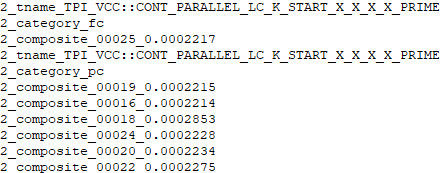
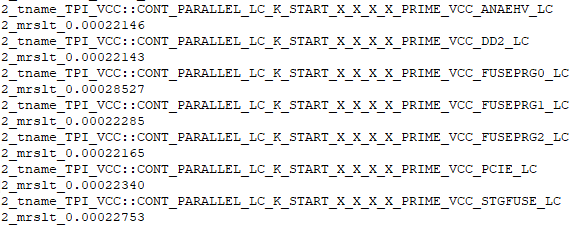

## DDG Prime DcPrint

# Introduction
DcPrint is a wrapper around the Prime Dc Test Method to print out individual measurements by test name and pin name instead of by pin number (composite format) to the iTUFF. 

# How to Use
The same setup and inputs are used for both Prime Dc and DcPrint, with the only difference being the iTuff and console log output. 

Prime's Dc output can be used at the same time as DcPrint's output if required. 

https://dev.azure.com/mit-us/PRIME/_wiki/wikis/PRIME.wiki/4088/Dc

# Datalog Output
| Prime Dc | DcPrint |
| -------- | ------- |
|  |  |

| **Date**       | **Version** | **Author**   | **Comments** |
| -------------- | ----------- | ------------ | ------------ |
| April 7, 2021  | 1.0.0       | milesyou     |  Initial doc |       
