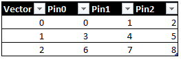

# DDG Prime SimpleCtv Test Class  
#### Latest: 3/25/2021 (fmurillo)  

# Introduction
SimpleCtv is a basic test class to grab CTV data from one or more pins and set kill limits.
# Methodology
Tester capture data is usually LSB-MSB, so the template gives the use the ability to reformat the bits indexes.
Each capture register is converted to an integer value and compared against per-register high and low limits.
User is also able to select what registers to print to datalog.
# Parameters
## Patlist
Plist name. Important: This test class process CTV data only. No fail data.
## LevelsTc
Levels test condition.
## TimingsTc
Timings test condition.
## CtvCapturePins
Comma-separated list of pins to capture CTV data. If more than one pin is being used, all data is going be concatenated one vector at the time. 

## Registers
Command-line parameter. Define any number of register using bits ranges or list of indexes. 
Registers = "--registers reg1:11-0 reg2:12,13,14"
## Print
Command-line parameter(optional). List registers to print to ituff.  
Print = "--registers reg1 reg2"
## Limits
Command-line parameter(optional). List high and low limits for each register. 
Limits = "--high reg2:10 --low reg1:856"
# Ports
[Returns(1, PortType.Pass, "Passed.")] 
[Returns(0, PortType.Fail, "Failed plist execution..")] 
[Returns(2, PortType.Fail, "Failed high limit.")] 
[Returns(3, PortType.Fail, "Failed low limit.")] 
[Returns(4, PortType.Fail, "Failed high and low limits.")] 